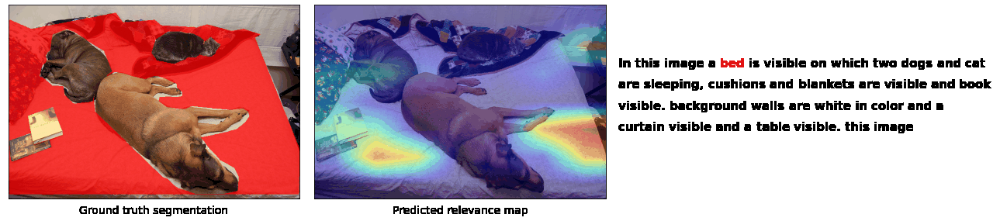

# CLIP-grounding
Quantitative evaluation of CLIP's interpretability in terms of cross-modal grounding.



## Abstract

Powerful multimodal models such as CLIP combine vision and language to reliably align image-text pairs. However, it is unclear if CLIP focuses on the *right signals* while aligning images and text. To answer this, we leverage a state-of-the-art attention-explainability method called [Transformer-MM-Explainability](https://github.com/hila-chefer/Transformer-MM-Explainability) and quantify how well CLIP grounds lingusitic concepts in images and visual concepts in text.

Towards this, we use the [Panoptic Narrative Grounding](https://bcv-uniandes.github.io/panoptic-narrative-grounding/) benchmark proposed by Gonzalez et al. that provides fine-grained segmentation masks corresponding to the parts of sentences.

## Setup

Follow the steps provided [here](./setup/README.md) to create a `conda` enviroment and activate it.

## Dataset

Download the MSCOCO dataset (only validation images are required for this work) and its panoptic segmentation annotations by running:

```zsh
bash setup/download_mscoco.sh
```

This shall result in the following folder structure:

```zsh
data/panoptic_narrative_grounding
├── __MACOSX
│   └── panoptic_val2017
├── annotations
│   ├── panoptic_segmentation
│   ├── panoptic_train2017.json
│   ├── panoptic_val2017.json
│   └── png_coco_val2017.json
└── images
    └── val2017

6 directories, 3 files
```
:hourglass: This step takes about 30 minutes (depending on your Internet connection).

<!-- 2. (Optional) Pre-process the data as instructed in the [official panoptic narrative grounding repo](https://github.com/BCV-Uniandes/PNG). See [Appendix A](#appA) for sample instructions to run this on a Mac CPU machine. This shall create `data/panoptic_narrative_grounding/annotations/png_coco_val2017_dataloader.json` file. Note that we run this step only for `val2017` split and not the training set. -->


## Demo

<!-- :date:  Coming soon! -->

In order to run our code on samples from the PNG benchmark dataset, please run [this notebook](./notebooks/qualitative_results.ipynb). It assumes that you have a `conda` environment setup as before and the dataset downloaded.

<!-- :date: A Gradio demo coming soon! -->

:hugs: Check out a Huggingface spaces demo [here](https://huggingface.co/spaces/PaulHilders/CLIPGroundingExplainability).


## Quantitative evaluation

In order to reproduce our results of CLIP model on Panoptic Narrative Grounding (PNG) benchmark dataset, we use the following procedure:
* Activate `conda` enviroment and set `PYTHONPATH`. Make sure you are at the repo root.
    ```sh
    conda activate clip-grounding
    export PYTHONPATH=$PWD
    ```
* Run the evaluation script:

**CLIP (multi-modal)**: To run evaluation with CLIP using both modes, run
```sh
python clip_grounding/evaluation/clip_on_png.py --eval_method clip
```
This shall save metrics in `outputs/` folder. Result (numbers) are presented below.
<!-- ```console
TEXT2IMAGE METRICS: {'iou': 0.4892}
IMAGE2TEXT METRICS: {'iou': 0.5015}
``` -->

**CLIP (unimodal)**: To run a stronger baseline using only one modality in CLIP, run
```sh
python clip_grounding/evaluation/clip_on_png.py --eval_method clip-unimodal
```

**Random baseline**: To run baseline evaluation (with random attributions), run
```sh
python clip_grounding/evaluation/clip_on_png.py --eval_method random
```

The cross-modal grounding results for different variants are summarized in the following table:

<center>

|                     | Random | CLIP-Unimodal | CLIP   |
|---------------------|--------|---------------|--------|
| Text-to-Image (IoU) | 0.2763 |     0.4310    | 0.4917 |
| Image-to-Text (IoU) | 0.2557 |     0.4570    | 0.5099 |

</center>


<!-- ## Appendix

### A. Pre-processing data based on Panoptic Narrative Grounding <a class="anchor" id="appA"></a>

* Clone the repo [PNG](https://github.com/BCV-Uniandes/PNG)
* Create `conda` environment and install dependencies:
    ```sh
    conda create -n png -y python=3.6
    conda activate png

    pip install torch==1.7.1 torchvision==0.8.2 torchaudio==0.7.2
    pip install tqdm scipy

    # This failed initially on Mac and needed
    # `brew install mpich` to be run before this
    pip install mpi4py
    pip install scikit-image
    pip install boto3 requests
    ```
* Change the script to only run for `val2017` split: Change line 34 in `data/pre_process.py` as:
    ```python
    # splits = ["train2017", "val2017"]
    splits = ["val2017"]
    ```
* Run the script:
    ```sh
    cd data/
    python pre_process.py --data_dir /path/to/CLIP-grounding/repo/data/panoptic_narrative_grounding/
    ```
    This step takes about 10 minutes to run (only for `val2017` split). -->


## Acknowledgements

We'd like to thank the TAs, in particular, [Jaap Jumelet](https://jumelet.ai/), for useful initial discussions, and the course instructor [Prof. Jelle Zuidema](https://staff.fnwi.uva.nl/w.zuidema/).

We greatly appreciate the open-sourced code/datasets/models from the following resources:
* [Panoptic Narrative Grounding](https://bcv-uniandes.github.io/panoptic-narrative-grounding/)
* [MS-COCO](https://cocodataset.org/#download)
* [CLIP](https://github.com/openai/CLIP) by OpenAI
* [Tramsformer multi-modal Explanability](https://github.com/hila-chefer/Transformer-MM-Explainability) by Hila Chefer et al.
